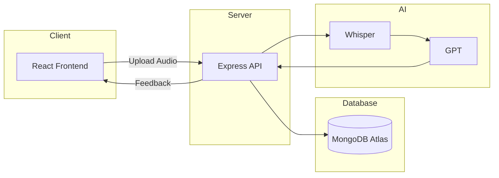

# SpeakForge AI - System Architecture

## High-Level Architecture

------------------------------------------------------------

## Frontend Responsibilities

- User Authentication
- Dashboard
- Daily Speaking Challenge
- Audio Recording
- Upload Audio
- Display AI Feedback
- Progress Tracking

------------------------------------------------------------

## Backend Responsibilities

- Authentication
- API Validation
- Receive Audio
- Store User Data
- Call Whisper API
- Call GPT API
- Save AI Results
- Return Response

------------------------------------------------------------

## Database Responsibilities

Collections

- Users
- Challenges
- SpeakingSessions
- Feedback

------------------------------------------------------------

## AI Layer

Whisper

Input:
Audio File

Output:
Transcript

↓

GPT

Input:
Transcript

Output:

- Grammar Score
- Fluency Score
- Pronunciation Suggestions
- Vocabulary Score
- Confidence Feedback

------------------------------------------------------------

## Request Flow

1. User logs in.

2. User receives today's challenge.

3. User records audio.

4. Audio uploaded to backend.

5. Backend stores audio temporarily.

6. Backend sends audio to Whisper.

7. Whisper returns transcript.

8. Backend sends transcript to GPT.

9. GPT returns evaluation.

10. Backend stores evaluation.

11. Frontend fetches results.

12. Dashboard updates.