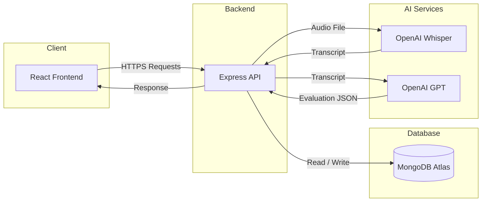

# SpeakForge AI - System Architecture

## Purpose

This document defines the major components of the system and explains how they interact to deliver AI-powered speaking evaluation.

---

# High-Level Architecture

---

# System Components

## 1. React Frontend

Responsibilities

- User Authentication
- Dashboard
- Daily Challenge
- Audio Recording
- Upload Audio
- Display AI Feedback
- History
- Progress Dashboard

Input

- User Interaction

Output

- API Requests

---

## 2. Express Backend

Responsibilities

- Authentication
- API Validation
- Business Logic
- File Upload
- AI Integration
- Database Operations

Input

- Frontend Requests

Output

- JSON Responses

---

## 3. MongoDB Atlas

Responsibilities

Store:

- Users
- Challenges
- Speaking Sessions
- AI Feedback
- Streak Information

---

## 4. OpenAI Whisper

Purpose

Convert uploaded speech into text.

Input

Audio File

Output

Transcript

---

## 5. OpenAI GPT

Purpose

Evaluate transcript.

Produces

- Grammar Score
- Fluency Score
- Vocabulary Score
- Confidence Feedback
- Improvement Suggestions

---

# Overall Execution

User

↓

Frontend

↓

Backend

↓

Whisper

↓

Transcript

↓

GPT

↓

Evaluation

↓

MongoDB

↓

Frontend

↓

User