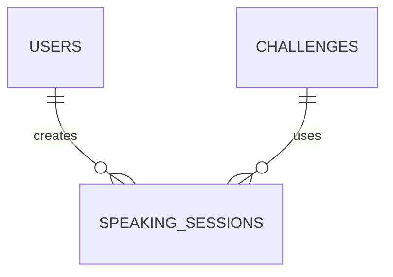

# SpeakForge AI - Database Design

## Purpose

This document defines the MongoDB data model for Version 1 of SpeakForge AI.

The primary design goal is:

- Simplicity
- Maintainability
- Scalability
- Fast development

---

# Database Overview

Version 1 contains **3 collections**.

```text
Users

Challenges

SpeakingSessions
```

Why only 3?

Because Version 1 only needs to support:

- Authentication
- Daily Challenge
- Audio Submission
- AI Evaluation
- History

No premium features.

No social features.

No leaderboards.

No notifications.

---

# Collection 1 — Users

## Purpose

Stores authenticated users.

## Fields

| Field | Type | Required | Description |
|--------|------|----------|-------------|
| _id | ObjectId | Yes | Mongo Primary Key |
| name | String | Yes | User Name |
| email | String | Yes | Google Email (Unique) |
| profilePicture | String | No | Profile Image |
| provider | String | Yes | google |
| streak | Number | Yes | Current Daily Streak |
| createdAt | Date | Yes | Account Creation |

## Why these fields?

name

Display inside Dashboard.

email

Unique identity.

profilePicture

Display Avatar.

provider

Future support for GitHub / Email Login.

streak

Dashboard progress.

createdAt

Analytics.

---

# Collection 2 — Challenges

## Purpose

Stores speaking tasks.

## Fields

| Field | Type | Required | Description |
|--------|------|----------|-------------|
| _id | ObjectId | Yes | Primary Key |
| title | String | Yes | Challenge Title |
| description | String | Yes | Speaking Prompt |
| category | String | Yes | Interview / Daily Conversation / Story |
| difficulty | String | Yes | Easy / Medium / Hard |
| estimatedDuration | Number | Yes | Seconds |
| isActive | Boolean | Yes | Whether challenge is available |
| createdAt | Date | Yes | Creation Date |

## Why keep challenges?

History should always reference the original challenge.

If tomorrow's challenge changes,

yesterday's session must still point to yesterday's prompt.

---

# Collection 3 — SpeakingSessions

## Purpose

Represents one speaking attempt.

One document = One recording.

## Fields

### References

| Field | Type |
|--------|------|
| userId | ObjectId |
| challengeId | ObjectId |

---

### Audio

| Field | Type |
|--------|------|
| audioUrl | String |

---

### Processing

| Field | Type |
|--------|------|
| status | String |

Possible values

- uploaded
- transcribing
- evaluating
- completed
- failed

---

### Transcript

| Field | Type |
|--------|------|
| transcript | String |

---

### AI Scores

| Field | Type |
|--------|------|
| grammarScore | Number |
| fluencyScore | Number |
| pronunciationScore | Number |
| vocabularyScore | Number |
| confidenceScore | Number |
| overallScore | Number |

---

### AI Feedback

| Field | Type |
|--------|------|
| strengths | Array<String> |
| weaknesses | Array<String> |
| suggestions | Array<String> |

---

### Metadata

| Field | Type |
|--------|------|
| createdAt | Date |

---

# Why Feedback is Embedded

Version 1 stores AI feedback inside SpeakingSessions.

Reason:

One speaking session always produces exactly one AI evaluation.

Creating another Feedback collection would:

- Increase complexity
- Require populate()
- Add unnecessary queries

If Version 2 introduces multiple AI evaluations for the same recording,

feedback can be extracted into its own collection.

---

# Collection Relationships



---

# Indexes

Users

- email (unique)

Challenges

- isActive

SpeakingSessions

- userId
- challengeId
- createdAt

---

# Future Collections (Not Version 1)

These are intentionally excluded.

- Notifications
- Payments
- Premium Plans
- AI Chat History
- Leaderboards
- Friends
- Achievements