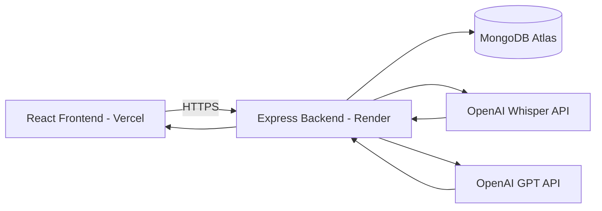

# SpeakForge AI - Deployment Guide

## Purpose

This document describes the production deployment architecture for Version 1 of SpeakForge AI.

---

# Deployment Architecture



---

# Frontend

Platform

- Vercel

Responsibilities

- React Application
- Audio Recording
- Authentication
- Dashboard
- History
- Feedback

Environment Variables

```
VITE_API_URL=
VITE_GOOGLE_CLIENT_ID=
```

---

# Backend

Platform

- Render

Responsibilities

- Authentication
- Business Logic
- Audio Upload
- AI Integration
- Database Operations

Environment Variables

```
PORT=

MONGODB_URI=

JWT_SECRET=

OPENAI_API_KEY=

CLIENT_URL=
```

---

# Database

Platform

MongoDB Atlas

Collections

- Users
- Challenges
- SpeakingSessions

---

# AI Services

## Whisper

Purpose

Speech → Text

---

## GPT

Purpose

Transcript → Evaluation

Returns

- Grammar
- Fluency
- Pronunciation
- Vocabulary
- Confidence
- Suggestions

---

# Request Flow

User

↓

React Frontend

↓

Express Backend

↓

Whisper

↓

Transcript

↓

GPT

↓

MongoDB

↓

React

↓

User

---

# Deployment Checklist

## Backend

- Environment Variables Configured

- MongoDB Connected

- OpenAI Key Added

- CORS Configured

- Health Route Working

---

## Frontend

- API URL Updated

- Production Build Successful

- Google Login Working

- Audio Upload Working

---

## Production Validation

- User Login

- Daily Challenge

- Audio Upload

- AI Evaluation

- Feedback Screen

- History

- Logout

---

# Version 1 Deployment Target

Frontend

- Vercel

Backend

- Render

Database

- MongoDB Atlas

AI

- OpenAI APIs

---

# Future Improvements

Version 2

- AWS S3

- Cloudflare CDN

- Redis Cache

- Queue Workers

- Background AI Processing

- Docker

- Kubernetes

- CI/CD Pipeline